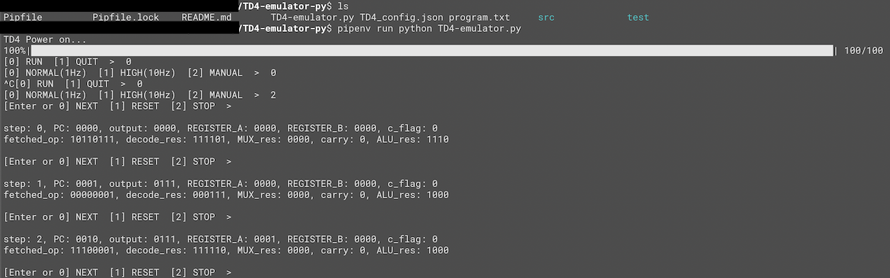

# TD4-emulator-py

**TD4-emulator-py** is a emulator of the legendary CPU: TD4 (とりあえず動作するだけの4bitCPU), which was created in the masterpiece: "CPUの創りかた" written by 渡波郁.  
TD4-emulator consists of logic circuit units implemented by Python except for FF (See `src/units.py`).    
`program.txt`, which is assembled and loaded into pseudo ROM by this tool when it is executed, is written to count 3 minutes and switch 4-bit console output per 1 min.     
  
You can exec and play this by 3-mode; clock cycle is 1 Hz, 10 Hz, or manual.  
And also this can be used as the 3-minutes *ramen timer* by using 1 Hz mode.   





# Installation and Usage
- Clone this repository and go to `TD4-emulator-py` directory where there is `TD4-emulator.py`.  
- Just type below, and TD4-emulator is executed.

```
$ pipenv run python TD4-emulator.py
```
